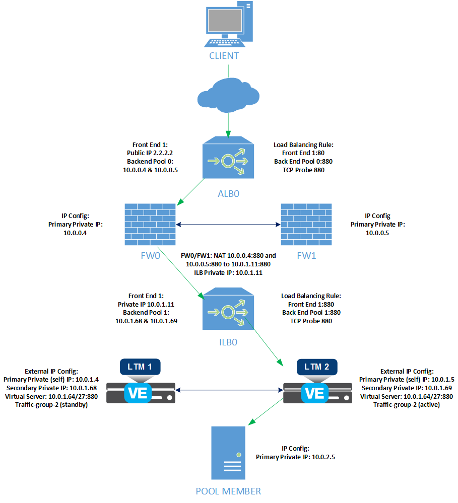
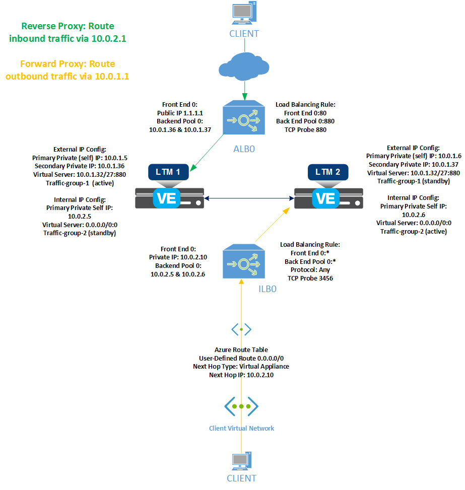

## Alternate Deployment Topologies - Cluster 3 NIC

This page contains some alternate deployment topology diagrams for the F5 cluster 3 NIC ARM template.

### BIG-IP VE HA pair load balancing reverse proxy traffic via firewalls 
In this example, we show an HA pair of BIG-IP VEs load balancing reverse proxy traffic via a redundant pair of firewalls.

### BIG-IP VE HA pair load balancing reverse proxy traffic via firewalls with second application on destination port
Load balance reverse proxy traffic between an HA pair of BIG-IPs via a redundant pair of firewalls. In this scenario, there is a second application scaled on the destination port.

### Cluster 3 NIC template alternate deployment
Load balance reverse proxy traffic between an HA pair of BIG-IPs via a redundant pair of firewalls Second application scaled on destination IP

### BIG-IP VE HA pair load balancing reverse/forward proxy traffic via firewalls using an Azure load balancer for East-West traffic

Load balance reverse/forward proxy traffic between an HA pair of BIG-IPs via a redundant pair of firewalls, using an Azure load balancer for East-West traffic.

After deployment, for this scenario you must perform the following post-deployment steps:

  - BIG-IP: Configure Failover Unicast Address and Primary Local Mirror Address on each device (the self IP on internal VLAN)  
  - BIG-IP: Create routes to internal subnets  
  - Delete the ALB created by the template  
  - Add secondary IP configurations to internal BIG-IP NICs  
  - Create and configure ILB1  
  - Create and configure ILB0 (optional)  
  - Create UDR (optional)  
  - BIG-IP: Create Virtual Server in traffic-group-1  

### BIG-IP VE HA pair load balancing reverse/forward proxy traffic via firewalls using an all-protocol Azure load balancer for forward proxy
Load balance reverse/forward proxy traffic between an HA pair of BIG-IPs using an all-protocol Azure load balancer for forward proxy

